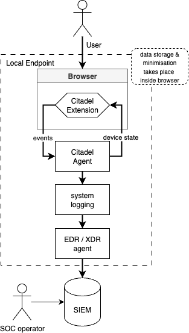

# **Data Privacy Impact Assessment : Citadel**

This Data Privacy Impact Assessment is intended as a **template** to be used by CISO / CIO during the Citadel deployment. The template should be carefully analysed, verified for compliance, and adapted to the specifics of the organisation, for example with respect to data retention, or use of external SIEM / SOAR solutions.

## **1.1 Overview**

### Description of the Processing Considered

| Description of the processing |  |
| :---- | :---- |
| Purposes of the processing | Enable CISOs and CIOs to protect sensitive web applications from cybersecurity threats and comply with legal, contractual, and regulatory obligations across the Security Incident Lifecycle (prevention, detection, response). |
| Stakes of the processing | Protection of personal and business data; prevention and detection of malware, policy breaches, shadow IT; compliance with cybersecurity policies and relevant data protection laws. |
| Data controller | Deployed organization (implementing Citadel within its IT estate); typically the IT or cybersecurity department. |
| Processor(s) | None by default (Citadel backendless by design). SIEM/XDR may act as a data processor for security events. |

### 

### Inventory of Applicable Frameworks for the Processing

| Applicable Frameworks for the processing                                                                                                                                                                  | Consideration |
|:----------------------------------------------------------------------------------------------------------------------------------------------------------------------------------------------------------| :---- |
| GDPR                                                                                                                                                                                                      | Fully considered. Legitimate interest is the legal basis. |
| Local data protection law(s)                                                                                                                                                                              | Considered; adoption depends on jurisdiction. |
| [Délibération n° 2021-122 du 14 octobre 2021 portant adoption d'une recommandation relative à la journalisation](https://www.cnil.fr/sites/default/files/atoms/files/recommandation_-_journalisation.pdf) | Considered; justifies legitimate interest finding. |
| Case study : [Time Doctor legal judgement](https://www.legifrance.gouv.fr/cnil/id/CNILTEXT000051120331)                                                                                                   | Considered; objections and infractions raised in application with similar scope are addressed. |
| [French privacy watchdog “web filtering recommendations”](https://www.cnil.fr/sites/default/files/2025-07/projet_reco_deploiement_solution_filtrage_web.pdf) (draft)                                      | Recommendations considered and integrated. |
| French privacy watchdog : [logging recommendations](https://www.cnil.fr/fr/la-cnil-publie-une-recommandation-relative-aux-mesures-de-journalisation)                                                      | Recommendations considered and integrated. |
| SIEM/XDR policies                                                                                                                                                                                         | Citadel events included in existing SIEM/XDR authorization, security, and retention policies. |

## **1.2 Data, Processes, and Media**

### Description of Data, Recipients, and Retention Periods

| Data | Recipients | Retention Periods |
| :---- | :---- | :---- |
| Endpoint username, browser profile username | Local storage, security team via SIEM/XDR events | Local: as long as agent installed; SIEM/XDR: as per policy |
| Web application usage statistics, application usernames | Local, security team via SIEM/XDR | Local: as long as agent installed; SIEM/XDR: as per policy |
| Download/upload/print metadata | Local, security team via SIEM/XDR | Local: as long as agent installed; SIEM/XDR: as per policy |
| Security events  | Local, security team via SIEM/XDR | Local: as long as agent installed; SIEM/XDR: as per policy |
| Web navigations | Local only | As long as agent installed |
| Web requests | Local only | N/A |
| Passwords (hashes only) | Local only | As long as agent installed |
| Endpoint compliance status | Local, security team via SIEM/XDR | Local: as long as agent installed; SIEM/XDR: as per policy |
| Security configuration, installed/running apps, stored documents | Local, security team via SIEM/XDR | Aggregated status / state only, as long as agent installed |
| Camera, microphone | Not processed | N/A |

### 

### Description of Processes and Media

| Process | Detailed Description of the Process | Relevant Data Supports |
| :---- | :---- | :---- |
| Local data collection | Citadel agent collects events and status from browsers and endpoints | Local browser storage, device storage |
| Event reporting | Significant security events, download / upload, and compliance events shipped to SIEM/XDR | SIEM / XDR integration (existing org infrastructure) |
| Data minimization | Storage of only summary / status or non-identifiable data where possible (e.g. hashes, aggregate use) | Local storage, SIEM / XDR |
| Endpoint control/status checks | Checks for forbidden apps, extensions, security compliance | Only summary control status stored |

# 

# **2 Fundamental Principles**

## **2.1 Assessment of Measures Ensuring the Proportionality and Necessity of Processing**

### Explanation and Justification of Purposes

| Purposes | Legitimacy |
| :---- | :---- |
| Security event detection, monitoring, prevention | Legitimate interest (GDPR Art. 6(1)(f)): protection of assets and compliance obligations |
| Incident response, forensics (DFIR) | Legitimate interest and legal obligations for post-incident investigation and prevention |
| Assurance of control efficacy and compliance | Legitimate interest; necessary to ensure security standards and policies are followed |

### Explanation and Justification of the Legal Basis

| Lawfulness Criteria | Applicable | Justification |
| :---- | :---- | :---- |
| The data subject has given consent to the processing of their personal data for one or more specific purposes | No | Not required—processing relies on legitimate interest for cybersecurity. |
| Processing is necessary for the performance of a contract | No | Not applicable. |
| Processing is necessary for compliance with a legal obligation to which the controller is subject | Partial | Security incident reporting may be required by law in some sectors. |
| Processing is necessary in order to protect the vital interests of the data subject or another natural person | No | Not the main basis. |
| Processing is necessary for the performance of a task carried out in the public interest or in the exercise of official authority | No | Not applicable. |
| Processing is necessary for the purposes of the legitimate interests pursued by the controller or by a third party | Yes | Citadel's objectives are necessary for IT security, legal and contractual obligations. |

### Explanation and Justification of Data Minimization

| Details of Data Processed | Categories | Justification of Need and Relevance of Data | Minimization Measures |
| :---- | :---- | :---- | :---- |
| Web navigation data (hashed) | Usage | Required for post-incident confirmation | URLs stored only as hashes, local storage only |
| Download/upload metadata | Usage | Investigate / mitigate exfiltration & malware incidents | Metadata only, no file content |
| Application use stats | Usage | Detection of shadow IT, ensure policy effectiveness | Only authenticated sites, aggregate interactions |
| Control status / info | Endpoint | Detect forbidden software / extensions, compliance | Only summary status saved (not process/file lists) |
| Account security status (password hashes, usage) | Usage | Detect poor password hygiene, identify risk | Only password hash / quality and only for protected/insecure accounts |

### Explanation and Justification of Data Quality

| Data Quality Measures | Justification |
| :---- | :---- |
| Agent-initiated periodic refresh | Ensures up-to-date, accurate endpoint and app status |
| SIEM / XDR event reporting | Relies on established SIEM / XDR pipelines for reliable event transport |
| Consistent data structures for event schemas | Ensures analysis and alerts remain accurate |

### Explanation and Justification of Retention Periods

| Types of Data | Retention Period | Justification of Retention Period | Deletion Mechanism at End of Retention |
| :---- | :---- | :---- | :---- |
| Current data (local storage) | As long as endpoint / agent installed | Needed for ongoing security monitoring | Deleted upon application/user deletion |
| Archived data / events in SIEM/XDR | As per SIEM / XDR policy | Retains logs for compliance, incident investigation | Follows SIEM/XDR deletion or expiration policy |
| Functional traces (local logs) | As above | Needed for troubleshooting, limited scope | Local wipe or agent uninstall |
| Technical logs (SIEM/XDR) | As above | Lawful, policy-compliant retention | Deletion per organizational retention policy |

### Assessment of Measures

| Measures Ensuring Proportionality and Necessity | Acceptable / Needs Improvement? | Corrective Measures |
| :---- | :---- | :---- |
| Purposes: determined, explicit and legitimate | Acceptable |  |
| Legal basis: lawful processing, prohibition of purpose deviation | Acceptable |  |
| Data minimization: adequate, relevant and limited | Acceptable | Periodic review of minimization vs. detection needs; suggestions for improvement welcomed. |
| Data quality: accurate and kept up to date | Acceptable |  |
| Retention periods: limited | Acceptable | Alignment with SIEM / XDR data retention policy |

## 

## **2.2 Assessment of Measures Protecting Data Subjects' Rights**

### Determination and Description of Measures for Informing Data Subjects

| Measures for the Right to Information | Implementation Methods | Justification |
| :---- | :---- | :---- |
| Security/privacy notice (this DPIA) | Document provided to end-users | Satisfies GDPR/DP notification duties |
| Notification of monitoring & rights | Briefing/email/documentation to all users | As per deployment checklist |
| Access to policy documents | Available via internal portal | Ensures understanding/transparency |
| Clear explanations (purpose, categories, rights) | Use of plain English, diagrams for technical docs | User comprehension and confidence |

If third-party data recipients (e.g., SIEM/XDR or incident responders):

| Purpose/Detail | Description in this DPIA & user notices | Transparency/Compliance Info |
| :---- | :---- | :---- |
| Detailed presentation of the purposes of transmission to third parties | Description in this DPIA & user notices | Complies with transparency requirement |
| Detailed presentation of personal data transmitted | Described for each use case/data type | See Data Processing table above |
| Identification of third party companies | SIEM / XDR vendor identified in policy | Provided in organization’s privacy documentation |

### 

### Determination and Description of Measures for Obtaining Consent

| Consent Collection Measures | Implementation Methods | Justification |
| :---- | :---- | :---- |
| Consent not collected | N/A | Processing is on legitimate interest basis; users always informed |
| Opt-out arrangements if required | Internal IT process | Reserved for exceptional (legal/jurisdictional) requirement |

### Determination and Description of Measures for Rights of Access and Portability

| Measures for Right of Access | Internal Data | External Data | Justification |
| :---- | :---- | :---- | :---- |
| Ability to access all user data via standard IT request | End-user or admin request, documented channel | SIEM/XDR events through established means | Compliance with GDPR access right |
| Download/archive of user data | By IT upon request | Provided through local admin or SIEM/XDR exports | Ensures portability and user control |

| Measures for the Right to Portability | Internal Data | External Data | Justification |
| :---- | :---- | :---- | :---- |
| Data provided in machine-readable format | CSV / JSON export (if needed) | Possible via SIEM/XDR data export functions | Compliance if requested/applicable |

### Determination and Description of Measures for Rights of Rectification and Erasure

| Measures for Rights of Rectification and Erasure | Internal Data | External Data | Justification |
| :---- | :---- | :---- | :---- |
| Rectification (if inaccurate) | Removal / correction via IT admin | Correction on SIEM / XDR if applicable | Ensures accuracy of record |
| Erasure (on request) | User data erased on agent removal or directed erasure request | Event erasure via SIEM/XDR process | Compliance with GDPR “right to be forgotten” |
| Explicit documentation of data retained (e.g., risk logs) | Yes | Technical / system constraints explained | Ensures transparency |

### Determination and Description of Measures for Rights to Restrict Processing and Object

| Measures for Rights to Restrict and Object | Internal Data | External Data | Justification |
| :---- | :---- | :---- | :---- |
| Ability to object to monitoring/reporting | Via IT helpdesk / process | Controls via policy/application uninstall | Ensures user rights, within legal bounds |
| Privacy configuration/deployment options | Defaults outlined in deployment guide | Documented for each installation |  |
| Parental / at risk protections | Not directly relevant (enterprise tool) | N/A | Users advised to raise concerns via IT |

### Determination and Description of Measures for Subcontracting

| Name of Subprocessor | Purpose | Scope | Contract Reference | Compliance with Art. 28 |
| :---- | :---- | :---- | :---- | :---- |
| SIEM / XDR vendor/service provider | Security event storage and management | Only events sent from Citadel | Organization’s SIEM/XDR contract | Yes: must be GDPR compliant |

### Determination and Description of Measures for Data Transfer outside the European Union

| Data | France | EU | Country recognized as adequate by the EU | Other country | Justification and Framework |
| :---- | :---- | :---- | :---- | :---- | :---- |
| Security events sent to SIEM/XDR | Possible | Possible | Possible | Possible | Data transfer control is via SIEM/XDR policy; if outside EU, clauses / SCCs must be in place |

### Assessment of Measures

| Measures Protecting the Rights of Data Subjects | Acceptable / Needs Improvement? | Corrective Measures |
| :---- | :---- | :---- |
| Information of data subjects | Acceptable | Routinely provide notices and updates |
| Collection of consent | Acceptable | Not applicable, as processing is on legitimate interest |
| Exercise of access and portability rights | Acceptable | Established IT / SIEM request process, regular review |
| Exercise of rectification and erasure rights | Acceptable | As above; periodic review |
| Exercise of restriction and objection rights | Acceptable | Policy for request handling, documentation |
| Subcontracting: identified and contractualized | Acceptable | SIEM/XDR agreements periodically reviewed |
| Transfers outside EU: obligations complied with | Acceptable (if SIEM / XDR contract aligns) | Ensure SCCs or equivalent are used when required |

# 

# **3 Data Security Risks**

## **3.1 Assessment of Measures**

### Description & Assessment of Measures Addressing Data Security Risks

| Specific Measures for Data Processing | Implementation Methods or Justification Otherwise | Acceptable / Needs Improvement? | Corrective Measures |
| :---- | :---- | :---- | :---- |
| Encryption | Local browser and device storage use OS-level encryption if available; SIEM / XDR events protected by industry standard encryption in transit and at rest | Acceptable | Encourage use of encrypted storage options on endpoints |
| Anonymization | Web navigation data is hashed locally; sensitive data minimized as much as possible | Acceptable, limited by security needs | Open to suggested improvements |
| Data segregation | Data by default stays on the endpoint except for event transmission | Acceptable | Periodic audit and confirmation |
| Logical access control | Access to SIEM/XDR event data via IAM; local data protected by OS user profiles | Acceptable | Periodic IAM review, restrict SIEM/XDR access to "need to know" |
| Traceability (audit logs) | SIEM / XDR maintains access and event logs | Acceptable | Ensure audit logs are regularly checked |
| Integrity control | SIEM / XDR and local systems apply hash / check mechanisms | Acceptable | Align with best practices |
| Archiving | Per SIEM / XDR and organizational data retention policy | Acceptable |  |
| Security of paper documents | Not applicable | N/A |  |

### Description & Assessment of General Security Measures

| General System Security Measures Where Processing is Implemented | Implementation Methods or Justification Otherwise | Acceptable / Needs Improvement? | Corrective Measures |
| :---- | :---- | :---- | :---- |
| Operational security | OS, browser, agent update policies | Acceptable | Regular patching policy |
| Protection against malware | Endpoints covered by org AV policy | Acceptable | Periodic policy check |
| Workstation management | Endpoint management via OS policy (locking, firewall, etc.) | Acceptable | Review on-boarding / off-boarding processes |
| Website security | N/A (no Citadel backend) | Acceptable |  |
| Backups | Data is local / SIEM / XDR, handled via org backup plan | Acceptable |  |
| Maintenance | Device runs standard org maintenance | Acceptable | SIEM/XDR arrangements documented |
| Security of IT channels (networks) | Transmission only via secure org channels (TLS/IAM/SCC) | Acceptable | Annual review of transport/encryption |

| General System Security Measures Where Processing is Implemented | Implementation Methods or Justification Otherwise | Acceptable / Needs Improvement? | Corrective Measures |
| :---- | :---- | :---- | :---- |
| Intrusion detection | SIEM/XDR logs monitored by SOC | Acceptable |  |
| Monitoring | SOC reviews logs/access | Acceptable | Regular process reviews |
| Physical access control | By org’s physical security policy | Acceptable |  |
| Equipment security | Device baseline security per org policy | Acceptable |  |
| Risk from location | Handled by org policy | Acceptable |  |
| Protection from non-human risks | Handled by org policy | Acceptable | Periodic check of DR / BCP, environmental risk mitigation plans |

### 

### Description & Assessment of Organizational Measures (Governance)

| Organizational Measures (Governance) | Implementation Methods or Justification Otherwise | Acceptable / Needs Improvement? | Corrective Measures |
| :---- | :---- | :---- | :---- |
| Organization/Assign roles | CISO / CIO responsible, roles defined in IT policy | Acceptable | Annual review of assignments |
| Policy (management) | Security/data protection policies in place | Acceptable |  |
| Risk management | Initial DPIA, periodic review, integration with org risk maps | Acceptable |  |
| Project management | Testing done with anonymized/fictive data pre-deployment | Acceptable |  |
| Incident / violation management | Documented SIEM / XDR / incident procedures | Acceptable | Test response regularly |
| Staff management | Onboarding/training documented | Acceptable |  |
| Third party relations | SIEM/XDR contract reviewed re: access, security controls | Acceptable |  |
| Supervision | Policy review, periodic DPIA/data minimization exercises | Acceptable | Annual / major update review |

## **3.2 Risk Assessment: Potential Privacy Breaches**

### Risk Analysis and Estimation

| Risk | Main Sources of Risk | Main Threats | Main Potential Impacts | Main Measures Reducing Severity and Likelihood | Severity | Likelihood |
| :---- | :---- | :---- | :---- | :---- | :---- | :---- |
| Unauthorized access to data | Insider threat, endpoint compromise, SIEM/XDR misconfig | Unauthorized staff access, exfiltration | Disclosure of sensitive activity, regulatory penalty | Access control, audit trail, SIEM/XDR encryption | Moderate | Low |
| Purpose deviation | Poor governance, training | Staff harassment, illegalility | Staff happiness negatively impacted, regulatory penalty | Data limitation by design | Moderate | Moderate |
| Unintended modification of data | SIEM/XDR config error, agent failure | False alerts, loss of data integrity | Misleading response or investigation | Audit logs, input validation, limited retention | Low | Low |
| Data loss | Device loss, SIEM/XDR failure | Loss of evidence / traces, incident under-reporting | Reduced security, possibly missed incidents | Data backup & retention, centralization via SIEM/XDR | Moderate | Low |

### 

### Risk Assessment

| Risks | Acceptable / Needs Improvement? | Corrective Measures | Residual Severity | Residual Likelihood |
| :---- | :---- | :---- | :---- | :---- |
| Unauthorized access to data | Acceptable (with proper access controls) | Covered by SIEM / XDR controls. Access to be logged and audited where possible.  | Moderate | Low |
| Purpose deviation | Acceptable | Training, access restriction | Low | Low |
| Unintended modification of data | Acceptable | Covered by SIEM / XDR controls | Low | Low |
| Data loss | Acceptable | Covered by SIEM / XDR controls  | Low | Low |
